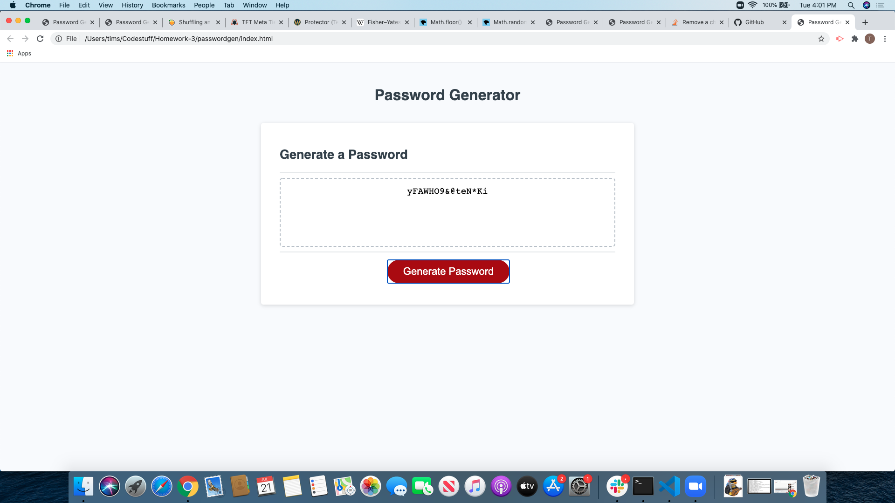

# Password Generator #

[Github pages link](https://tbsanders5.github.io/passwordgen/)

## Description ##

A simple program to generate a random password through a series of prompts. Code is designed to create secure passwords based on the wants of the user. The options are character numbers between 8 and 128, uppercase letters, lowercase letters, special characthers and numbers.

## Resources ##

* [Nancy Lambert-Brown](https://github.com/n-lambert)
* [Plover Brown](https://github.com/rebgrasshopper)
* [Zachary Bryan](https://github.com/zacharybryan)
* [Nicholas Konzen](https://github.com/NTKonzen)
* [Talia Vazquez](https://github.com/taliavazquez)
* [Fisher-Yates shuffle](https://en.wikipedia.org/wiki/Fisher%E2%80%93Yates_shuffle)

## Usage ##

Used to create random passwords following certain criteria.
1. Click Generate Password
1. Choose length of password
1. Pick paramaters you would like to use
1. Password will appear in designated area

## License ##

GNU General Public License

---

Copyright (c) 2020 Sanders, Timothy

Permission is hereby granted, free of charge, to any person obtaining a copy
of this software and associated documentation files (the "Software"), to deal
in the Software without restriction, including without limitation the rights
to use, copy, modify, merge, publish, distribute, sublicense, and/or sell
copies of the Software, and to permit persons to whom the Software is
furnished to do so, subject to the following conditions:

The above copyright notice and this permission notice shall be included in all
copies or substantial portions of the Software.

THE SOFTWARE IS PROVIDED "AS IS", WITHOUT WARRANTY OF ANY KIND, EXPRESS OR
IMPLIED, INCLUDING BUT NOT LIMITED TO THE WARRANTIES OF MERCHANTABILITY,
FITNESS FOR A PARTICULAR PURPOSE AND NONINFRINGEMENT. IN NO EVENT SHALL THE
AUTHORS OR COPYRIGHT HOLDERS BE LIABLE FOR ANY CLAIM, DAMAGES OR OTHER
LIABILITY, WHETHER IN AN ACTION OF CONTRACT, TORT OR OTHERWISE, ARISING FROM,
OUT OF OR IN CONNECTION WITH THE SOFTWARE OR THE USE OR OTHER DEALINGS IN THE
SOFTWARE.
